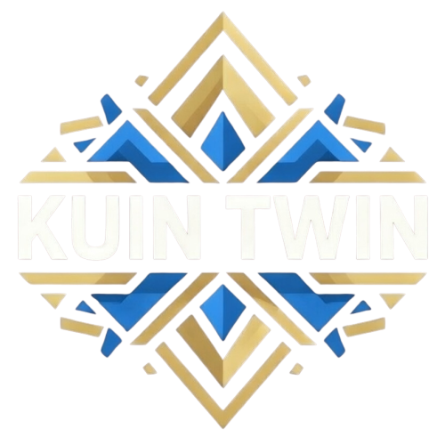

# 🏙️ Kuin Twin - Marketplace de Servicios Profesionales

<div align="center">
  
  <p><i>Conectando talento con oportunidades en un solo lugar.</i></p>
</div>

---

## 🚀 Acerca de Kuin Twin

**Kuin Twin** es una plataforma tipo "Mercado Libre" diseñada exclusivamente para la oferta y demanda de servicios profesionales. Desde trabajadores independientes (freelancers) hasta grandes empresas corporativas con múltiples sucursales, Kuin Twin centraliza el ecosistema de servicios bajo un modelo de suscripción y planes de publicación.

### ✨ Características Principales
*   **🏢 Soporte Multicapa**: Manejo de profesionales independientes y estructuras empresariales con sucursales (`Branches`).
*   **🛡️ Validación SAT México**: Verificación de identidad fiscal para empresas reales para garantizar la seguridad.
*   **📍 Búsqueda Geolocalizada**: Encuentra servicios cerca de ti gracias a la potencia de **PostGIS**.
*   **💎 Modelo de Monetización**: Sistema de planes para publicación de servicios y visibilidad destacada.
*   **📅 Gestión de Reservas**: Sistema integrado de slots de tiempo y confirmación de citas.

---

## 🏗️ Estructura del Proyecto (Monorepo)

Este proyecto está gestionado con **TurboRepo** para optimizar la compilación y el desarrollo:

*   **`apps/api`**: Backend robusto con NestJS, Prisma y PostgreSQL.
*   **`apps/web-store`**: Portal público para clientes desarrollado en Next.js.
*   **`apps/admin-panel`**: Dashboard administrativo construido con Vite y React.
*   **`libs/shared-types`**: Definiciones de Zod y tipos compartidos para validación *full-stack*.
*   **`libs/ui-components`**: Librería de componentes UI (shadcn/ui) para una interfaz coherente.

---

## 📖 Documentación Completa

Para profundizar en el funcionamiento del sistema, consulta nuestra documentación oficial:

1.  **[📚 Índice de Documentación](./docs/INDEX.md)**: Punto de inicio para navegar por los manuales.
2.  **[🏗️ Arquitectura](./docs/ARCHITECTURE.md)**: Detalles sobre el stack técnico y flujo de datos.
3.  **[💼 Modelo de Negocio](./docs/BUSINESS_MODEL.md)**: Roles, planes y **Validación SAT**.
4.  **[📊 Diagramas del Sistema](./docs/DIAGRAMS.md)**: Visualización de flujos y base de datos (Mermaid).
5.  **[🛠️ Guía de Desarrollo](./docs/DEVELOPMENT.md)**: Instrucciones para configurar el entorno local.

---

## ⚙️ Inicio Rápido

```bash
# 1. Instalar dependencias
npm install

# 2. Configurar variables de entorno (Ver docs/DEVELOPMENT.md)
# ... editar .env en apps/api y apps/web-store

# 3. Iniciar entorno de desarrollo
npm run dev
```

---
<div align="center">
  <p>© 2026 Kuin Twin Team. Todos los derechos reservados.</p>
</div>
