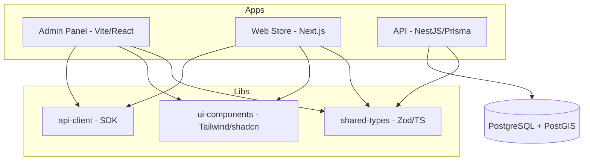
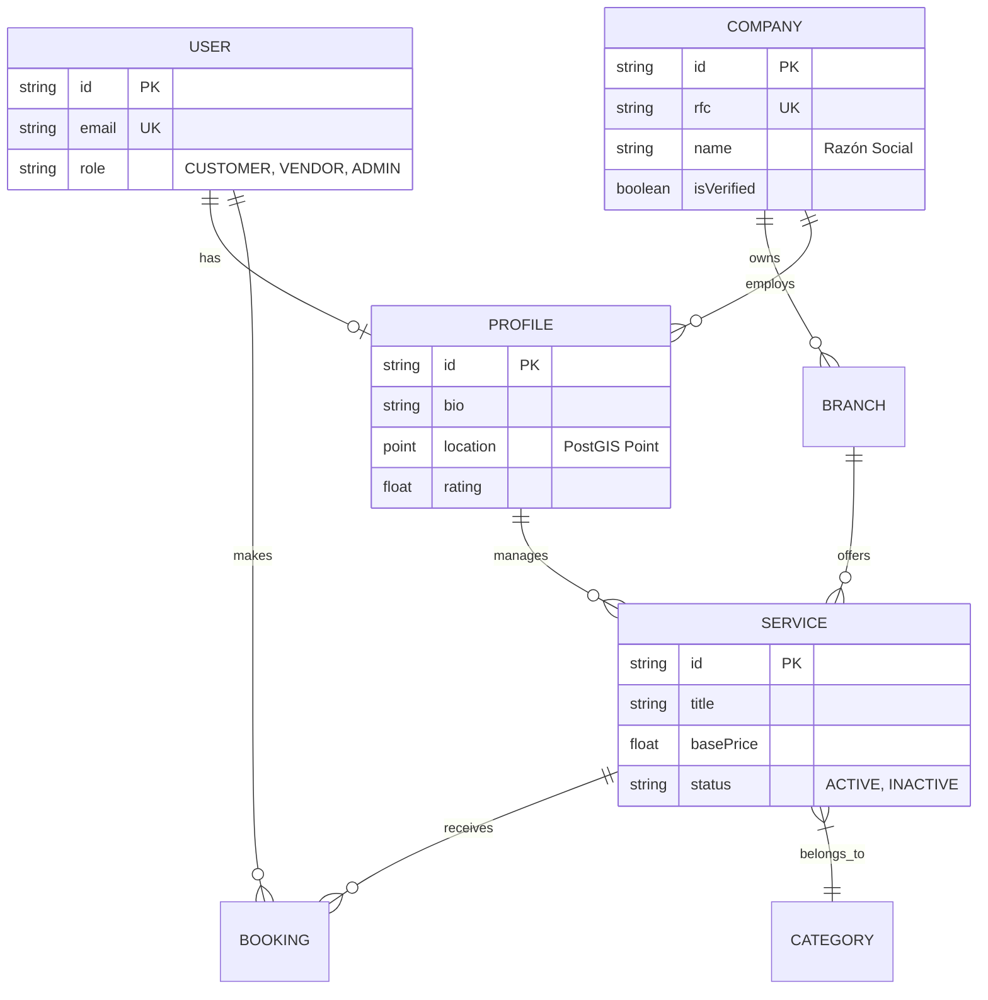
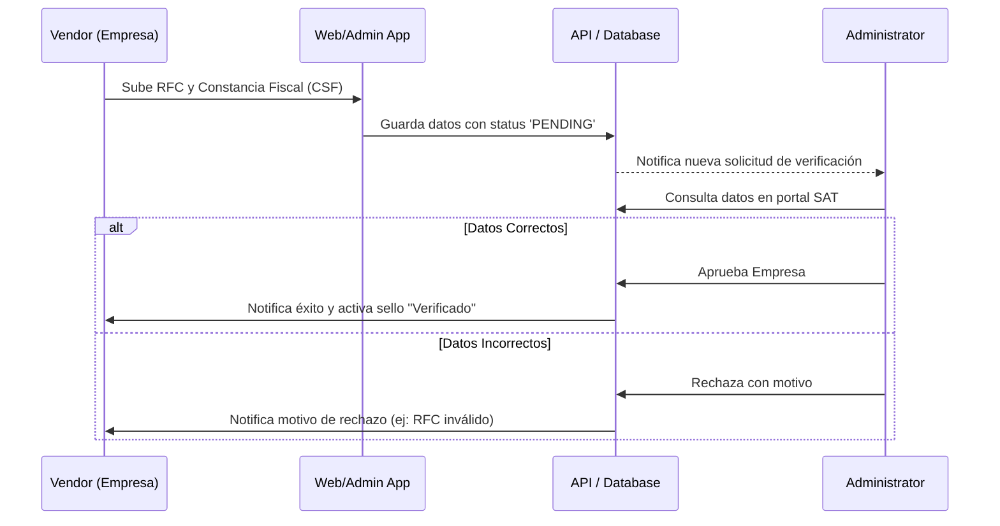

# 📊 Diagramas del Sistema

En esta sección se visualizan los flujos y estructuras principales de Kuin Twin.

## 🏗️ Arquitectura del Monorepo

Este diagrama muestra cómo se conectan las aplicaciones con las librerías compartidas.

## 🗄️ Modelo de Datos (ERD)

Representación de las entidades principales y sus relaciones.

## 🛡️ Flujo de Verificación SAT

Proceso de validación de una empresa por parte de un administrador.

